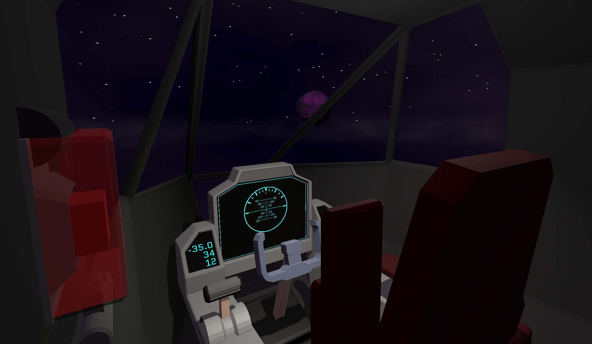
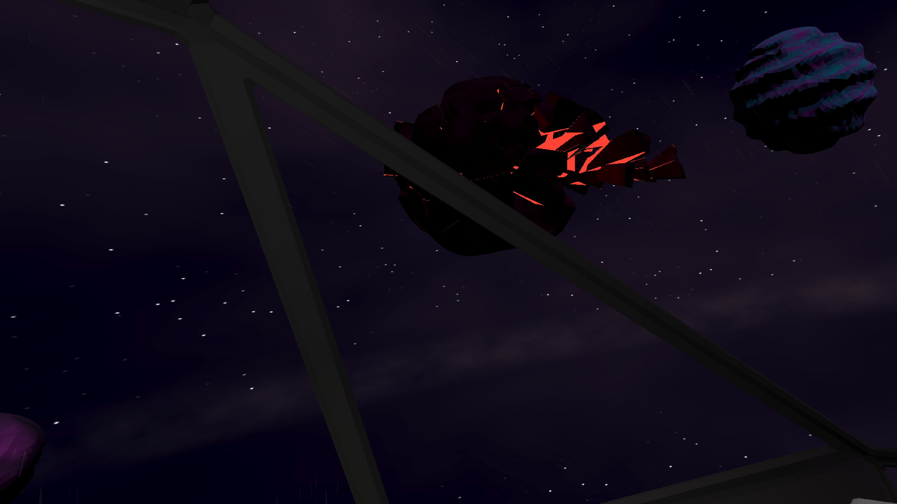
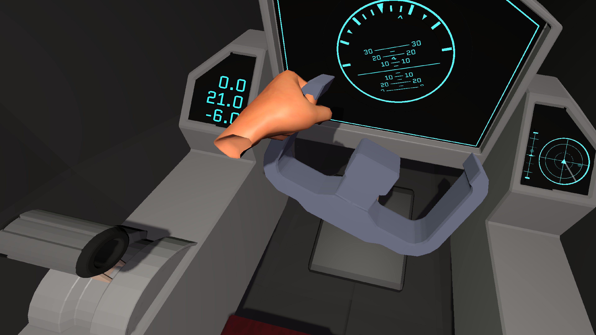
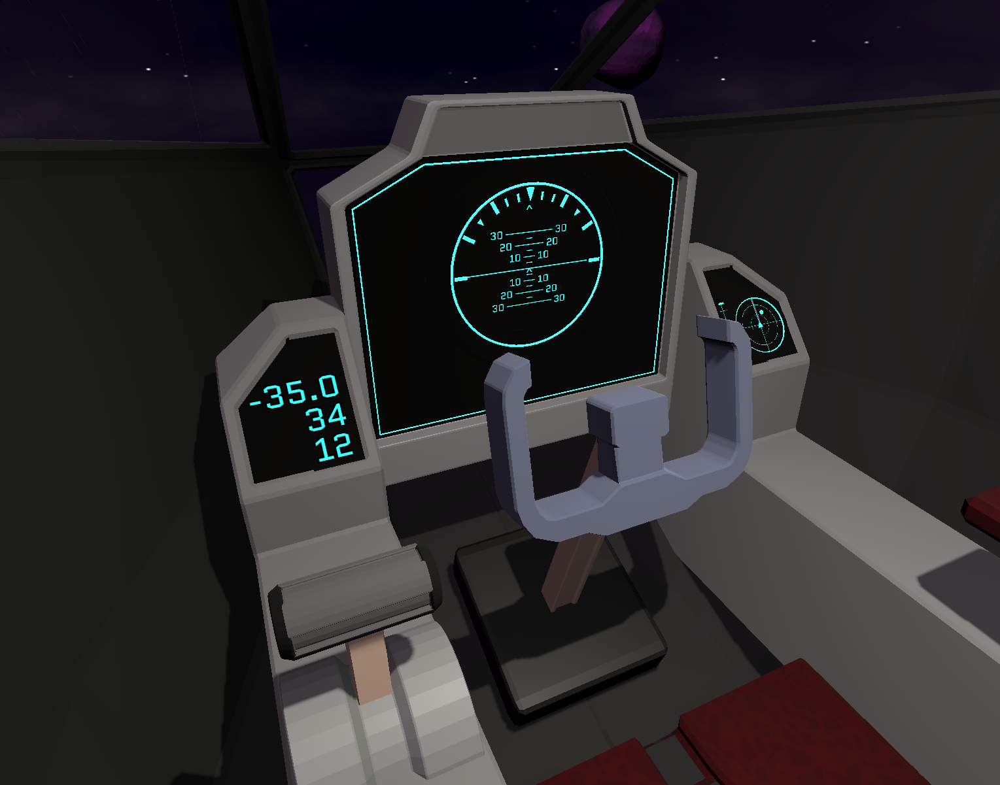
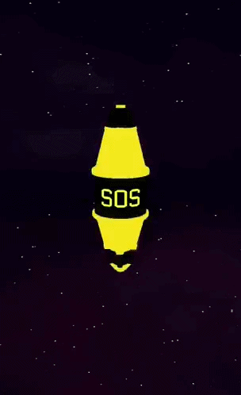
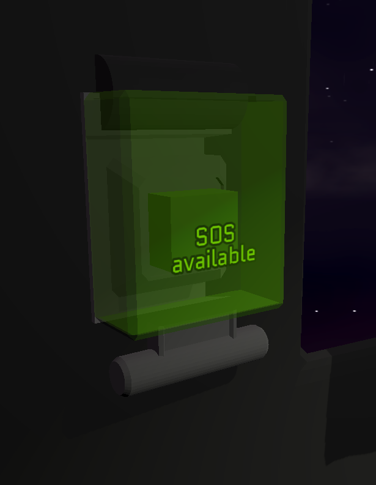
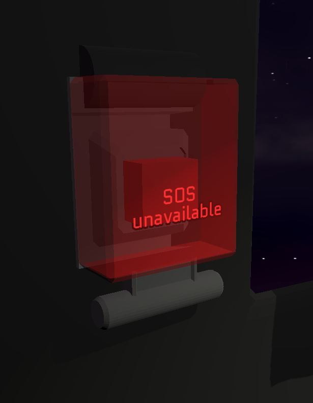
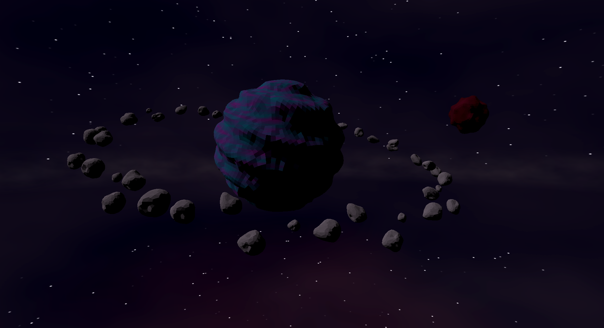
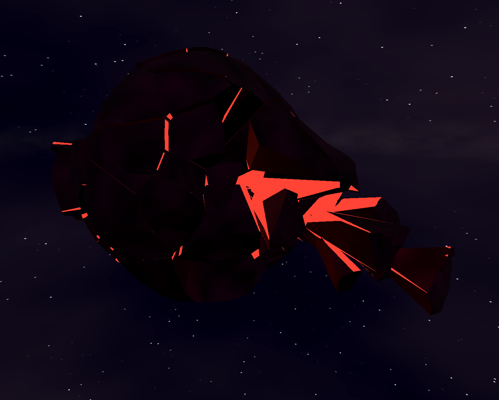

# The Final Ploy

This repo stores source code for the game "The Final Ploy" which was made for [Godot XR Game Jam - Sep 2026].
On branch "days", there are 7 commits, each commit done at the end of the development day. 

Disclaimer: Game was developed fast, so in many places the code written overly complicated or/and not optimized at all. 

Game jam submission : https://itch.io/jam/godot-xr-game-jam-sep-2026/rate/5065276

Game on itch.io : https://luklev.itch.io/the-final-ploy

### Lore: ⠀

You were sent to explore sector #G98C . It is one of the most dangerous sectors in that area. Many missions have failed to return because of the chaotic environment. Due to the amount of crashes that have happened in #G98C a lot of debris can be found. Which makes traveling even more difficult. Your mission was to collect as much data in #G98C as possible.

You succeded but.... .. On the way back a crash happened.. you fell unconsious.. ⠀

After you wake up, the damange on the ship is critical but manual controlls still work. Luckly in #G98C was sent a SOS beacon. Your last chance of survival is to find it and send SOS signal.

Be aware of debris
Good luck, you will need it.

### Info & Quick Tips: ⠀

Controlls:

Use throttle on the left to move forwards and backwards.
Rotate the yoke to turn right / left and lean the yoke to pitch up / down
⠀(Yoke will smoothly return to base position as soon as released)

To send sos signal you need to be in close of the sos beacon.
⠀First you open the glass protector and then press the button with your first. ⠀

Hints:

Look & Listen to your navigator (on your right), it will show you the dot (it is the sos beacon).

### Screenshots:

 

 

 

|   |      |
| ---------------------------------------------- | ------------------------------------------------ |
|  |  |

 

 

### BUILD:

Build was done on Godot 4.7.2.stable. 

Build for Quest. 
